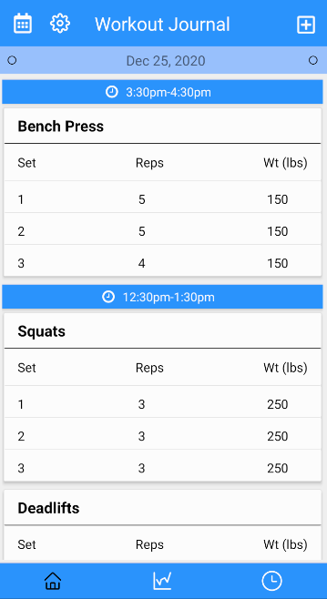
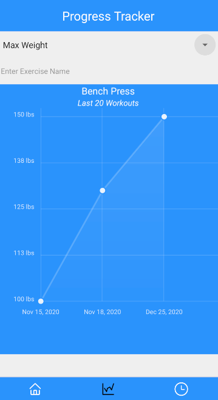
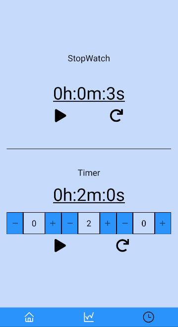
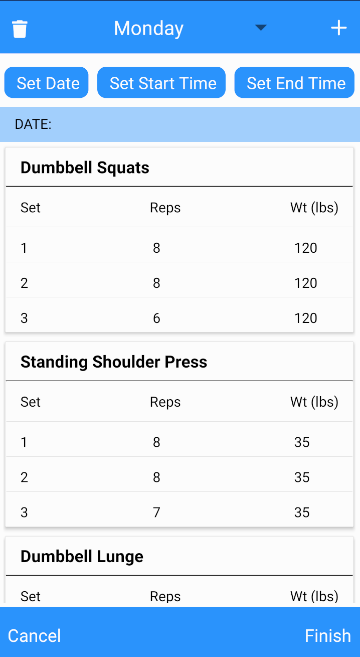
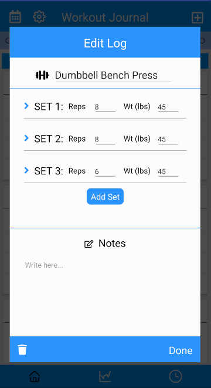

## WorkoutJournal
A workout tracker app that allows users to log their workouts, create routines, and track their progress over time.

## Installation
Download the apk file here: https://drive.google.com/file/d/1pis3rLNy_WB-javc4nNqWAge_wkpHQTC/view?usp=sharing

## Screenshots

  
  
  
  
  
  

## Features
- Easy conversion between Imperial (Lbs) and Metric (Kgs)
- Add a routine for faster addition of workout logs
- Graph to display your progress in a specified exercise
- Stopwatch and Timer 

## Built With
- [React Native](https://reactnative.dev/)
